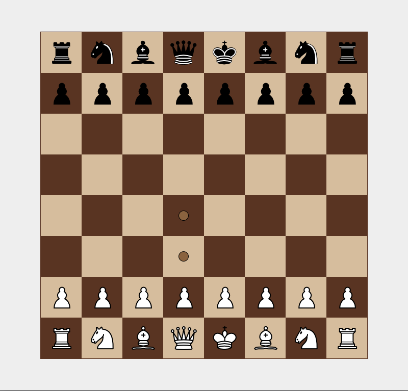

# Chess project with simple AI ♟️
A java chess game that uses minimax algorithm with alpha-beta prunning
to decide the best possible move for computer player.

## Running application

Clone the repository and run:
`mvn package`
`mvn exec:java` or run jar file with `java -jar target/chess-1.0.jar`

You need maven installed on your computer.

## Features
- Chess rules implementation(currently only en passant rule is not supported)
- AI evaluation function
- Move generation
- Move history
- Make move/undo move (only for AI, gameplay does not support that)

## Graphical user interface
- GUI made in swing.
- Support move highlighting. (Only possible moves are highlighted.)
- Pop-up window with promotion.
- Restarting or exiting game after the game ended.

## Future tweaks
- Add en passant rule
- Make stronger AI move validation (sometimes it stucks into a loop)
- Add restart button (now you have to close the application if you want to restart the game)